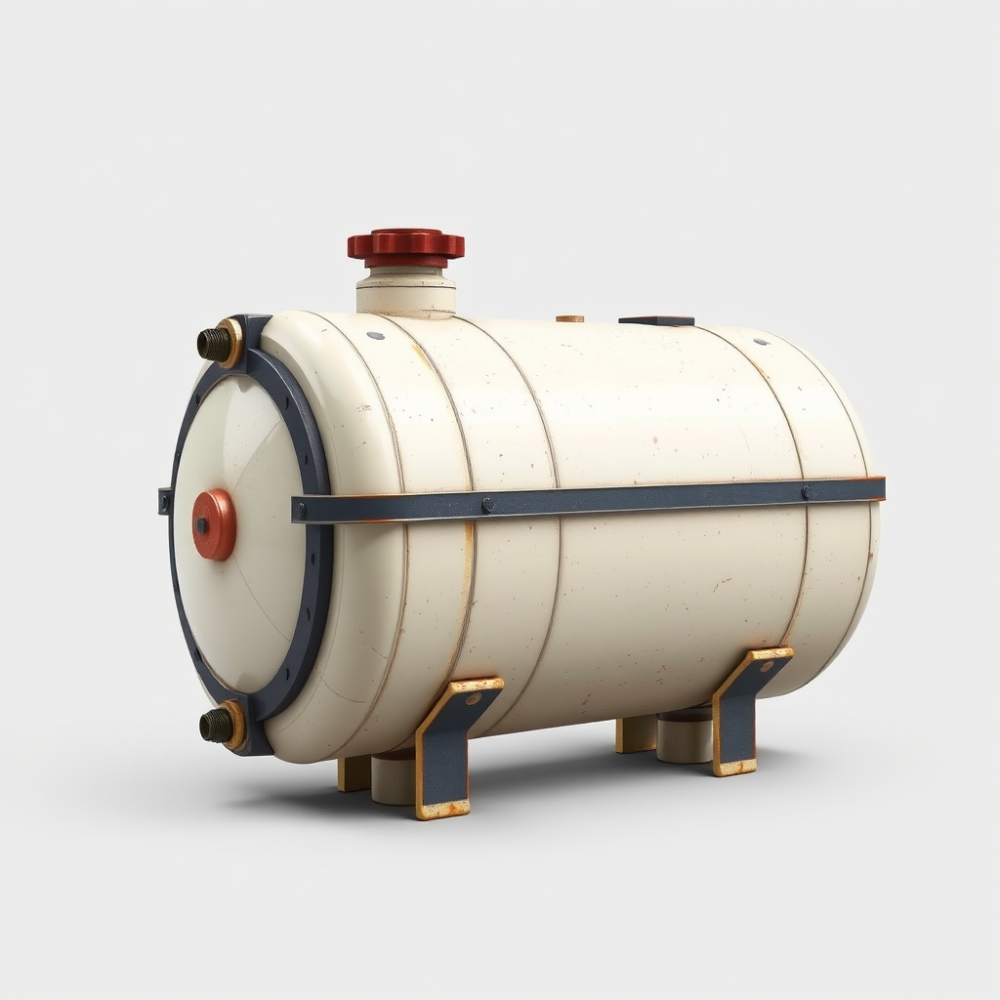
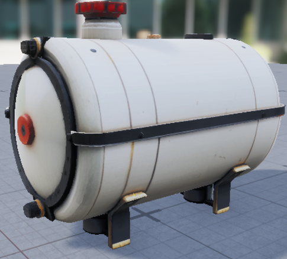
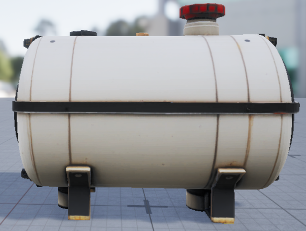

# Asset Factory V0.8

Asset Factory génère et prépare localement des assets 3D à partir d'un prompt texte ou d'une image.

```text
Prompt
  -> image
  -> génération 3D
  -> normalisation Blender
  -> import Unreal optionnel
```

Moteurs 3D pris en charge :

- **TRELLIS**
- **TripoSR**

La génération multi-vues avec **Zero123++** est optionnelle.

---

## Aperçu

<table>
  <tr>
    <td align="center"><strong>Prompt</strong></td>
    <td align="center"><strong>Image de référence</strong></td>
    <td align="center"><strong>Asset importé dans Unreal Engine</strong></td>
  </tr>
  <tr>
    <td align="center">/</td>
    <td align="center"></td>
    <td align="center"></td>
  </tr>
  <tr>
    <td align="center">A compact industrial spaceship fuel tank, single isolated object, realistic hard-surface design, short vertical cylindrical body with rounded end caps, sturdy metal construction, slightly worn off-white painted surface, subtle scratches and edge wear, two dark metal support bands around the tank, small red valve and simple pipe connector on top, a few technical details but clean overall silhouette, functional utilitarian design, fully visible, centered, three-quarter view, neutral plain light gray background, soft studio lighting, even exposure, clear readable shape, realistic product render, no environment, no text, no logo, no character.</td>
    <td align="center"></td>
    <td align="center"></td>
  </tr>
</table>

---

## Prérequis

- Windows PowerShell 5.1+ ou PowerShell 7+
- GPU CUDA recommandé
- Blender
- Unreal Engine uniquement pour l'import automatique

---

## Installation

```powershell
git clone https://github.com/guillaumeRG/AssetFactory.git
Set-Location .\AssetFactory

.\setup-asset-factory.ps1 install

.\setup-asset-factory.ps1 comfyui install
.\setup-asset-factory.ps1 comfyui model-install

.\setup-asset-factory.ps1 triposr install

.\setup-asset-factory.ps1 trellis runtime-install
.\setup-asset-factory.ps1 trellis model-install

.\setup-asset-factory.ps1 multiview install -Method zero123plus-v1.1
.\setup-asset-factory.ps1 multiview model-install -Method zero123plus-v1.1
```

Vérification :

```powershell
.\setup-asset-factory.ps1 status
.\setup-asset-factory.ps1 doctor
```

---

## Démarrer ComfyUI

```powershell
Set-Location .\engines\comfyui
.\.venv\Scripts\python.exe .\main.py --lowvram --listen 127.0.0.1 --port 8188
```

Puis revenir dans un second terminal à la racine d'Asset Factory.

---

# Utilisation

Asset Factory expose trois commandes principales.

## 1. Générer une image depuis un prompt

Une seule image :

```powershell
.\tools\generate-image.ps1 `
    -Prompt "compact industrial storage tank, worn metal, isolated object, neutral studio background" `
    -AssetId "StorageTank_Ref_01" `
    -Candidates 1 `
    -Seed 1234
```

Sélection automatique de la meilleure image parmi plusieurs candidats :

```powershell
.\tools\generate-image.ps1 `
    -Prompt "compact industrial storage tank, worn metal, isolated object, neutral studio background" `
    -NegativePrompt "text, logo, broken geometry" `
    -AssetId "StorageTank_Ref_02" `
    -Candidates 8 `
    -Seed 1234
```

`-Candidates 1` génère une seule image.

`-Candidates N` génère N candidats puis conserve automatiquement la meilleure référence.

---

## 2. Générer un asset depuis une image

### TRELLIS direct

```powershell
.\tools\generate-asset-from-image.ps1 `
    -InputPath ".\reference.png" `
    -AssetId "StorageTank_01" `
    -GeometryMethod trellis `
    -MultiviewMethod none `
    -TargetHeight 1.5 `
    -AutoImport $false
```

### TRELLIS avec multi-vues

```powershell
.\tools\generate-asset-from-image.ps1 `
    -InputPath ".\reference.png" `
    -AssetId "StorageTank_MV_01" `
    -GeometryMethod trellis `
    -MultiviewMethod zero123plus-v1.1 `
    -TargetHeight 1.5 `
    -AutoImport $false
```

### TripoSR

```powershell
.\tools\generate-asset-from-image.ps1 `
    -InputPath ".\reference.png" `
    -AssetId "StorageTank_TripoSR_01" `
    -GeometryMethod triposr `
    -MultiviewMethod none `
    -TargetHeight 1.5 `
    -AutoImport $false
```

---

## 3. Générer un asset directement depuis un prompt

### Best-of-N puis TRELLIS direct

```powershell
.\tools\generate-asset-from-prompt.ps1 `
    -Prompt "compact industrial storage tank, worn metal, isolated object, neutral studio background" `
    -NegativePrompt "text, logo, broken geometry" `
    -AssetId "StorageTank_02" `
    -Candidates 8 `
    -Seed 1234 `
    -GeometryMethod trellis `
    -MultiviewMethod none `
    -TargetHeight 1.5 `
    -AutoImport $false
```

### Best-of-N puis multi-vues puis TRELLIS

```powershell
.\tools\generate-asset-from-prompt.ps1 `
    -Prompt "compact industrial storage tank, worn metal, isolated object, neutral studio background" `
    -AssetId "StorageTank_MV_02" `
    -Candidates 8 `
    -GeometryMethod trellis `
    -MultiviewMethod zero123plus-v1.1 `
    -TargetHeight 1.5 `
    -AutoImport $false
```

### Best-of-N puis TripoSR

```powershell
.\tools\generate-asset-from-prompt.ps1 `
    -Prompt "compact industrial storage tank, worn metal, isolated object, neutral studio background" `
    -AssetId "StorageTank_TripoSR_02" `
    -Candidates 4 `
    -GeometryMethod triposr `
    -MultiviewMethod none `
    -TargetHeight 1.5 `
    -AutoImport $false
```

---

## Paramètres principaux

```text
-Prompt            prompt image
-NegativePrompt    éléments à éviter
-AssetId           identifiant de l'asset
-Candidates        nombre d'images candidates
-Seed              seed de génération
-InputPath         image source existante
-GeometryMethod    trellis ou triposr
-MultiviewMethod   none ou zero123plus-v1.1
-TargetHeight      hauteur finale en mètres
-ProjectProfile    profil Unreal optionnel
-AutoImport        import Unreal automatique
```

Paramètres multi-vues utiles :

```text
-FusionMode
-IncludeReference
-ViewPolicy
-MaxViews
-MinViewScore
```

---

## Import Unreal

```powershell
.\tools\generate-asset-from-image.ps1 `
    -InputPath ".\reference.png" `
    -AssetId "Console_01" `
    -GeometryMethod trellis `
    -MultiviewMethod none `
    -TargetHeight 1.2 `
    -ProjectProfile ".\profiles\mon-projet.json" `
    -AutoImport $true
```

---

## Batches

Image uniquement :

```powershell
.\tools\run-batch.ps1 `
    -BatchPath ".\batches\mon-batch.json" `
    -Mode images `
    -Candidates 8
```

Pipeline complet :

```powershell
.\tools\run-batch.ps1 `
    -BatchPath ".\batches\mon-batch.json" `
    -Mode full `
    -Engine trellis `
    -Candidates 8 `
    -AutoImport $false
```

Avec multi-vues :

```powershell
.\tools\run-batch.ps1 `
    -BatchPath ".\batches\mon-batch.json" `
    -Mode full `
    -Engine trellis `
    -Candidates 8 `
    -MultiviewMethod zero123plus-v1.1 `
    -AutoImport $false
```

---

## Sorties

Les assets sont versionnés :

```text
outputs/
└─ assets/
   └─ StorageTank_01/
      ├─ v001/
      ├─ v002/
      └─ ...
```

Une génération peut contenir notamment :

```text
source/
raw/
final/
logs/
metadata/
generation.json
```

Les versions existantes ne sont pas écrasées.

---

## Vérifications

```powershell
.\setup-asset-factory.ps1 status
.\setup-asset-factory.ps1 doctor
.\setup-asset-factory.ps1 comfyui status
.\setup-asset-factory.ps1 comfyui doctor
.\setup-asset-factory.ps1 triposr status
.\setup-asset-factory.ps1 triposr doctor
.\setup-asset-factory.ps1 trellis model-status
```

Tests du cycle :

```powershell
.\tests\test-cycle-contracts.ps1
```

---

## Structure

```text
AssetFactory/
├─ batches/
├─ blender/
├─ config/
├─ docs/
├─ engines/
├─ models/
├─ outputs/
├─ profiles/
├─ tools/
│  ├─ generate-image.ps1
│  ├─ generate-asset-from-image.ps1
│  ├─ generate-asset-from-prompt.ps1
│  ├─ internal/
│  └─ run-batch.ps1
├─ unreal/
├─ workflows/
├─ setup-asset-factory.ps1
└─ README.md
```

Les anciens scripts `run-*.ps1` restent disponibles pour le debug et les usages bas niveau.
