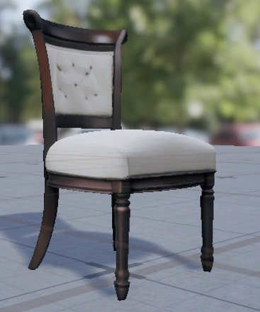

# Asset Factory

Asset Factory est une chaîne locale de génération et de préparation d'assets 3D à partir d'un prompt texte.

Le but est simple :

```text
Prompt
  -> image générée par IA
  -> génération 3D
  -> normalisation dans Blender
  -> import optionnel dans Unreal Engine
```

Deux moteurs image-vers-3D sont pris en charge :

- **TRELLIS** : génère un GLB texturé ;
- **TripoSR** : génère un mesh 3D plus simple et rapide.

Le moteur peut être choisi à chaque génération avec `-Engine trellis` ou `-Engine triposr`.

---


## Aperçu rapide

Exemple de résultat obtenu avec la chaîne complète : image de référence -> asset 3D généré -> import dans Unreal Engine.

<table>
  <tr>
    <td align="center"><strong>Image de référence</strong></td>
    <td align="center"><strong>Asset importé dans Unreal Engine</strong></td>
  </tr>
  <tr>
    <td align="center"></td>
    <td align="center"></td>
  </tr>
</table>

---

## 1. Prérequis

Le bootstrap cible actuellement **Windows** avec :

- Windows PowerShell 5.1+ ou PowerShell 7+ ;
- un GPU compatible CUDA recommandé ;
- Blender pour la normalisation des meshes ;
- Unreal Engine uniquement si l'import automatique est utilisé.

---

## 2. Installation rapide

Cloner le dépôt :

```powershell
git clone https://github.com/guillaumeRG/AssetFactory.git
Set-Location .\AssetFactory
```

Installer ou détecter les outils communs :

```powershell
.\setup-asset-factory.ps1 install
```

Installer ComfyUI et son modèle d'image :

```powershell
.\setup-asset-factory.ps1 comfyui install
.\setup-asset-factory.ps1 comfyui model-install
```

Installer TripoSR si ce moteur doit être utilisé :

```powershell
.\setup-asset-factory.ps1 triposr install
```

Installer TRELLIS si ce moteur doit être utilisé :

```powershell
.\setup-asset-factory.ps1 trellis runtime-install
.\setup-asset-factory.ps1 trellis model-install
```

Vérifier l'installation :

```powershell
.\setup-asset-factory.ps1 status
.\setup-asset-factory.ps1 doctor
```

Les commandes d'installation sont prévues pour être **idempotentes** : les composants déjà installés et valides sont réutilisés.

---

## 3. Démarrer ComfyUI

Le serveur ComfyUI doit être lancé avant une génération complète.

Depuis la racine d'Asset Factory :

```powershell
Set-Location .\engines\comfyui
.\.venv\Scripts\python.exe .\main.py --lowvram --listen 127.0.0.1 --port 8188
```

Laisser ce terminal ouvert.

L'interface et l'API sont ensuite disponibles sur :

```text
http://127.0.0.1:8188
```

Revenir dans un autre terminal à la racine du dépôt :

```powershell
Set-Location <chemin-vers-AssetFactory>
```

---

## 4. Générer un asset 3D

### Avec TRELLIS

```powershell
.\tools\run-image-to-3d.ps1 `
    -Prompt "compact industrial storage tank, worn metal, isolated object, neutral studio background" `
    -AssetId "StorageTank_01" `
    -TargetHeight 1.5 `
    -Engine trellis
```

Le cycle est :

```text
Prompt
  -> ComfyUI
  -> PNG
  -> TRELLIS
  -> GLB texturé
  -> Blender
  -> GLB normalisé
```

Le GLB final est placé sous :

```text
outputs\pipelines\<pipeline-id>\processed\StorageTank_01.glb
```

### Avec TripoSR

```powershell
.\tools\run-image-to-3d.ps1 `
    -Prompt "compact industrial storage tank, worn metal, isolated object, neutral studio background" `
    -AssetId "StorageTank_01" `
    -TargetHeight 1.5 `
    -Engine triposr
```

Le cycle est :

```text
Prompt
  -> ComfyUI
  -> PNG
  -> TripoSR
  -> mesh brut
  -> Blender
  -> OBJ / FBX normalisés
```

Si `-Engine` n'est pas renseigné, **TripoSR reste le moteur par défaut** pour conserver la compatibilité avec les anciennes commandes.

---

## 5. Paramètres principaux

Les paramètres les plus utiles de `run-image-to-3d.ps1` sont :

```text
-Prompt         description de l'asset à générer
-AssetId        nom de l'asset et des fichiers produits
-Seed           seed de génération d'image
-TargetHeight   hauteur finale souhaitée en mètres
-Engine         trellis ou triposr
-ProjectProfile profil de destination optionnel
-AutoImport     active ou désactive l'import automatique
```

Exemple sans import automatique :

```powershell
.\tools\run-image-to-3d.ps1 `
    -Prompt "small sci-fi crate" `
    -AssetId "Crate_01" `
    -TargetHeight 0.8 `
    -Engine trellis `
    -AutoImport $false
```

---

## 6. Import automatique dans Unreal Engine

L'import Unreal est **optionnel** et piloté par un profil JSON.

Exemple :

```powershell
.\tools\run-image-to-3d.ps1 `
    -Prompt "small industrial console" `
    -AssetId "Console_01" `
    -TargetHeight 1.2 `
    -Engine trellis `
    -ProjectProfile ".\profiles\mon-projet.json" `
    -AutoImport $true
```

Le profil contient les chemins et options propres au projet consommateur. Asset Factory ne contient aucune règle spécifique à un jeu ou à un produit particulier.

Pour TRELLIS, les GLB sont importés avec leurs matériaux et textures lorsque le profil le permet.

### Important : éditeur Unreal déjà ouvert

L'import automatique utilise `UnrealEditor-Cmd`.

Si Unreal Editor est déjà ouvert pendant l'import, les fichiers `.uasset` peuvent être créés correctement sur disque sans apparaître immédiatement dans le Content Browser de l'éditeur déjà lancé.

Dans ce cas :

1. vérifier que les `.uasset` existent dans le dossier `Content` du projet ;
2. fermer Unreal Editor ;
3. rouvrir le projet.

Les assets importés apparaîtront alors dans le Content Browser.

---

## 7. Générer uniquement une image

Avec ComfyUI déjà démarré :

```powershell
.\tools\run-comfyui.ps1 `
    -Prompt "industrial storage container, clean silhouette, neutral studio background" `
    -Seed 1234
```

Les images et métadonnées sont stockées sous :

```text
outputs\jobs\
```

---

## 8. Générer directement depuis une image existante

### TRELLIS

```powershell
.\tools\run-trellis.ps1 `
    -InputPath ".\mon-image.png"
```

Le GLB généré reprend le nom du PNG :

```text
mon-image.png -> mon-image.glb
```

### TripoSR

```powershell
.\tools\run-triposr.ps1 `
    -InputPath ".\mon-image.png"
```

---

## 9. Génération par lots

Les batches sont décrits par des manifestes JSON dans :

```text
batches\
```

Pour lancer un batch complet avec TRELLIS :

```powershell
.\tools\run-batch.ps1 `
    -BatchPath ".\batches\mon-batch.json" `
    -Engine trellis
```

Avec TripoSR :

```powershell
.\tools\run-batch.ps1 `
    -BatchPath ".\batches\mon-batch.json" `
    -Engine triposr
```

Les traitements GPU lourds sont exécutés séquentiellement afin de limiter les conflits de VRAM.

Les anciens batches d'images peuvent rester en mode image uniquement. Le mode 3D complet doit être demandé explicitement lorsqu'il n'est pas défini dans le manifeste.

---

## 10. Sorties

Chaque pipeline possède son propre dossier :

```text
outputs\pipelines\<pipeline-id>\
```

Exemple avec TRELLIS :

```text
outputs\pipelines\<pipeline-id>\
├─ input\
│  └─ StorageTank_01.png
├─ generated\
│  └─ trellis\
│     └─ StorageTank_01.glb
├─ processed\
│  └─ StorageTank_01.glb
├─ logs\
└─ pipeline.json
```

`pipeline.json` indique notamment :

- le moteur utilisé ;
- l'image d'entrée ;
- le modèle généré ;
- les dimensions finales ;
- la hauteur cible ;
- le statut du pipeline ;
- l'étape ayant échoué, le cas échéant.

Les fichiers intermédiaires sont conservés afin qu'une étape en erreur puisse être diagnostiquée ou relancée sans recalculer tout le pipeline.

---

## 11. TRELLIS hors ligne

Une fois les modèles installés avec :

```powershell
.\setup-asset-factory.ps1 trellis model-install
```

le runner TRELLIS utilise les modèles locaux préparés par Asset Factory.

Pour vérifier leur présence :

```powershell
.\setup-asset-factory.ps1 trellis model-status
```

---

## 12. Vérifications utiles

État général :

```powershell
.\setup-asset-factory.ps1 status
```

Diagnostic général :

```powershell
.\setup-asset-factory.ps1 doctor
```

ComfyUI :

```powershell
.\setup-asset-factory.ps1 comfyui status
.\setup-asset-factory.ps1 comfyui doctor
```

TripoSR :

```powershell
.\setup-asset-factory.ps1 triposr status
.\setup-asset-factory.ps1 triposr doctor
```

TRELLIS :

```powershell
.\setup-asset-factory.ps1 trellis model-status
```

Test des contrats du cycle sans lancer de génération réelle :

```powershell
.\tests\test-cycle-contracts.ps1
```

---

## 13. Structure simplifiée du dépôt

```text
AssetFactory/
├─ batches/
├─ blender/
│  └─ scripts/
├─ docs/
├─ engines/
│  ├─ comfyui/
│  ├─ trellis/
│  └─ triposr/
├─ models/
├─ outputs/
├─ profiles/
├─ tools/
│  ├─ import-unreal.ps1
│  ├─ run-batch.ps1
│  ├─ run-comfyui.ps1
│  ├─ run-image-to-3d.ps1
│  ├─ run-trellis.ps1
│  └─ run-triposr.ps1
├─ unreal/
├─ workflows/
├─ setup-asset-factory.ps1
└─ README.md
```

Les dossiers contenant les moteurs, modèles lourds et sorties de génération doivent rester hors Git lorsqu'ils sont déjà couverts par les règles du dépôt.

---
